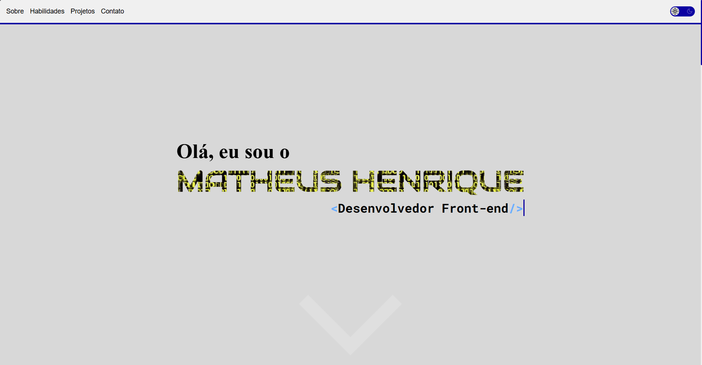
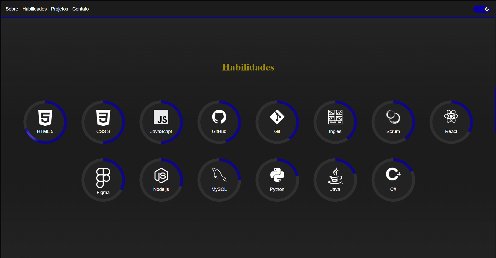
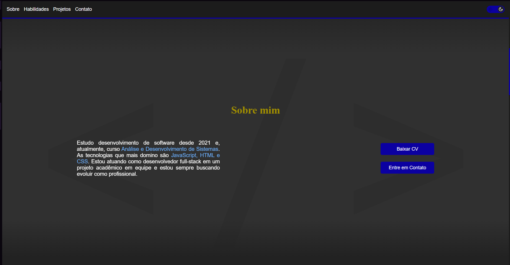
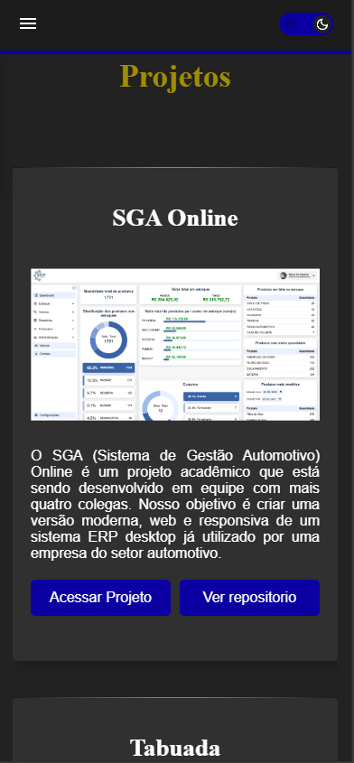
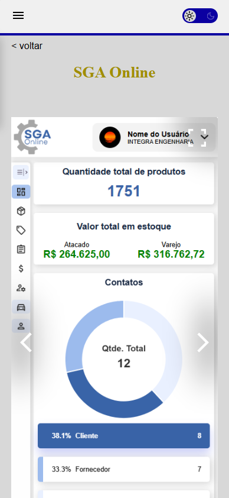

# Matheus Henrique - Portfólio Profissional

  
  
  
  

    
    
  

## ✨ Demonstração

[🔗 Acesse o portfólio online](https://matheushnunes.github.io/portfolio)  
[🎥 Veja um vídeo demonstrativo](https://youtu.be/6kScLAQ3_A0)

## 🚀 Sobre o Projeto

Portfólio profissional desenvolvido para mostrar meus projetos, habilidades e experiência. O site apresenta:

- Apresentação pessoal
- Seção de habilidades técnicas
- Galeria de projetos realizados
- Formas de contato

## 🛠 Tecnologias Utilizadas

- **React**  - Biblioteca JavaScript para construção de interfaces
- **SCSS** - Pré-processador CSS
- **Figma** - Prototipação
- **Git** - Controle de versão
- **Vite** - Build tool rápida

## 🎨 Design e Acessibilidade

- Design responsivo (mobile, tablet, desktop)
- Modo claro/escuro
- Totalmente acessível (ARIA, semântica HTML)
